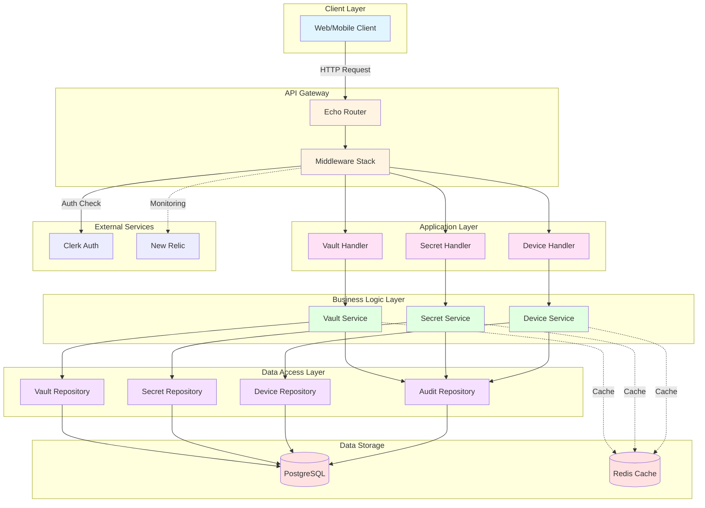
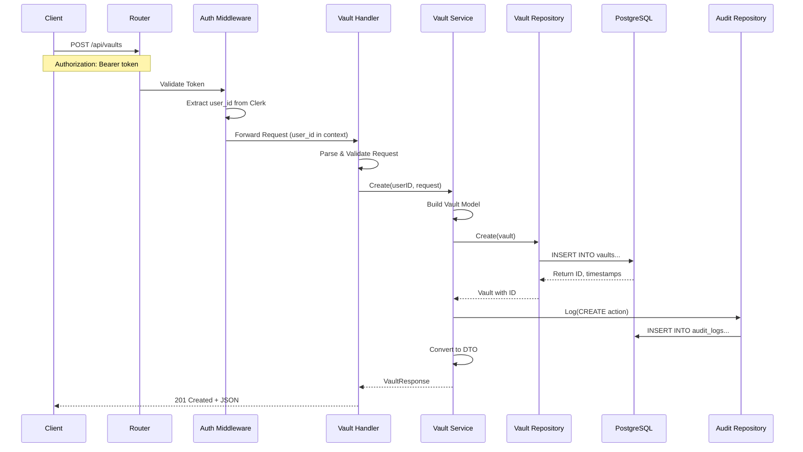
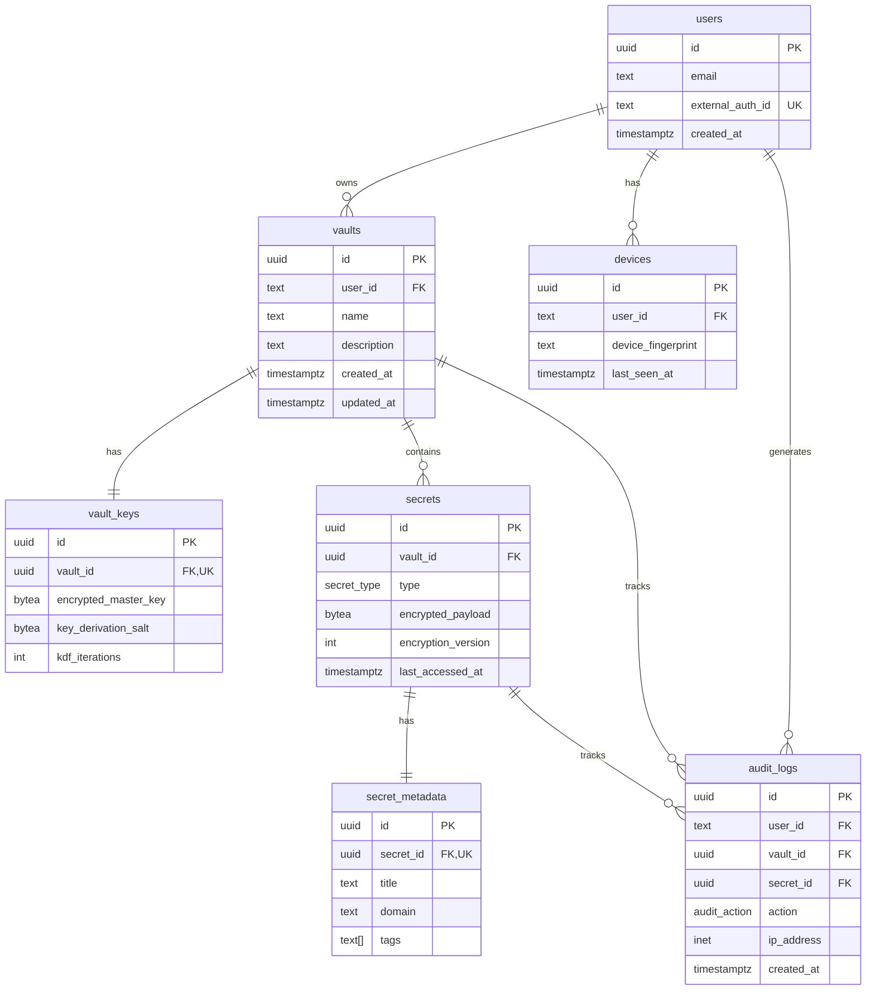
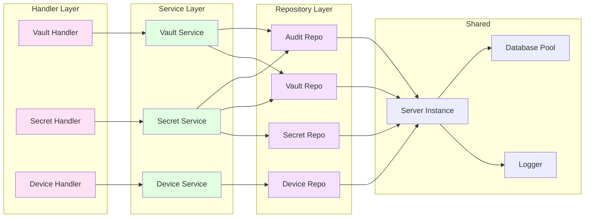
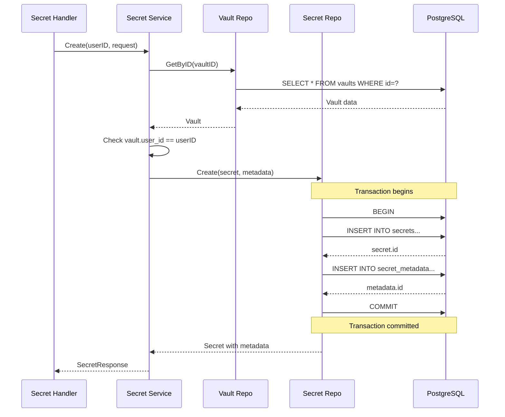
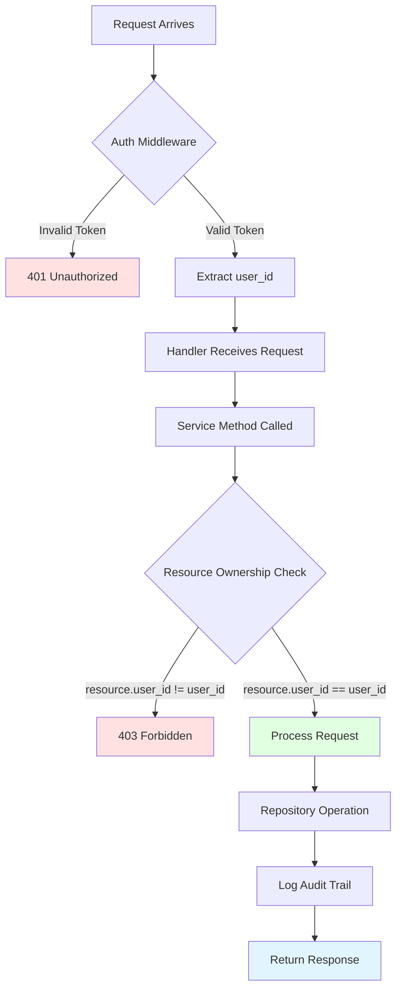
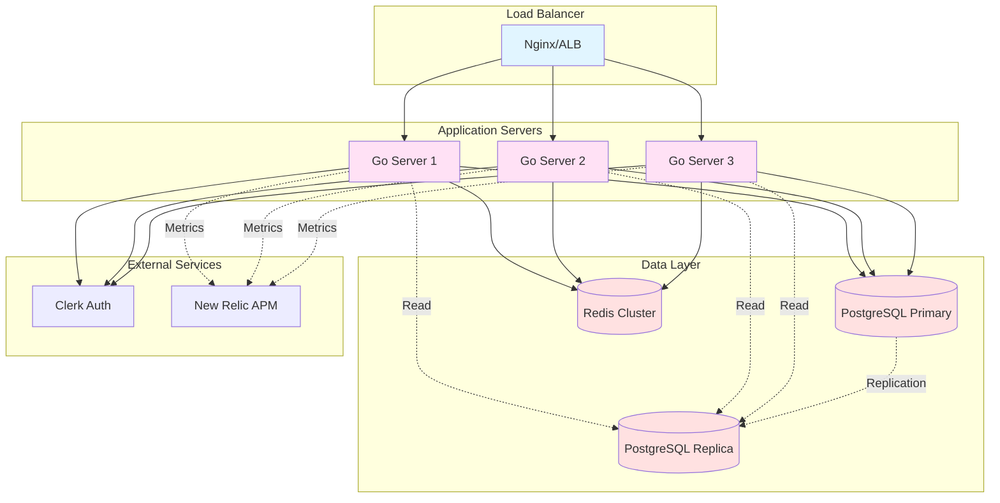

# PSVault Backend Architecture Diagrams

## System Architecture

## Request Flow - Create Vault

## Database Schema

## Component Dependencies

## Middleware Chain

```mermaid
graph LR
    Request[HTTP Request] --> RL[Rate Limiter]
    RL --> CORS[CORS Handler]
    CORS --> RID[Request ID]
    RID --> NR[New Relic Tracer]
    NR --> CE[Context Enhancer]
    CE --> Log[Request Logger]
    Log --> Auth[Auth Middleware]
    Auth --> Recover[Panic Recovery]
    Recover --> Handler[Route Handler]
    
    style Request fill:#e1f5ff
    style Auth fill:#ffe1e1
    style Handler fill:#e1ffe1
```

## Secret Creation Flow (with Metadata)

## Authorization Flow

## Deployment Architecture

